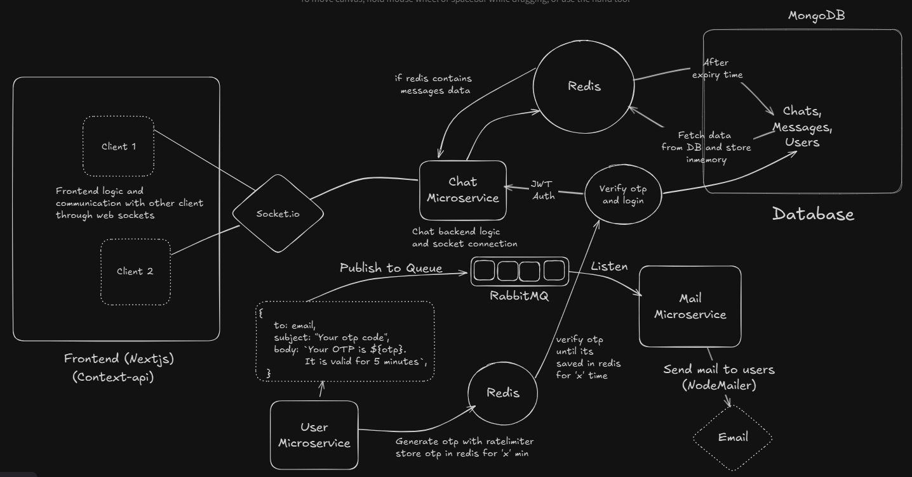

# 💬 Chatify — Real-time Scalable Chat Application (Microservices Architecture)

**Chatify** is a fully functional **real-time chat application** built using **Next.js**, **Node.js**, **Socket.IO**, **MongoDB**, **Redis**, and **RabbitMQ**.  
It follows a **microservices architecture**, demonstrating real-world concepts like async communication, event-driven design, caching, and secure authentication.

---

## 🚀 Overview

Chatify allows users to:
- Sign up and log in using **OTP verification**.
- Send and receive **real-time messages** via **Socket.IO**.
- View online/offline status of users.
- Secure sessions with **JWT Authentication**.
- Send OTP emails asynchronously via **RabbitMQ + Mail Microservice**.
- Handle rate-limited OTP generation stored in **Redis**.

This project demonstrates **scalable backend design** and **modern full-stack development** — ideal for resume and interview discussions.

---

## 🧠 Architecture Diagram



---

## ⚙️ Tech Stack

| Layer | Technology |
|-------|-------------|
| **Frontend** | Next.js, React, Socket.IO-client |
| **Backend** | Node.js, Express, Socket.IO |
| **Database** | MongoDB |
| **Cache / OTP Store** | Redis |
| **Message Queue** | RabbitMQ |
| **Email Service** | NodeMailer |
| **Authentication** | JWT |
| **Containerization** | Docker, Docker Compose |

---

## 🧩 Microservices Breakdown

### 🗨️ Chat Microservice
- Handles all **real-time socket connections** using **Socket.IO**.
- Manages chat rooms, user online status, and message events.
- Persists messages and chats in MongoDB.

### 👤 User Microservice
- Handles **user registration**, **login**, and **OTP generation**.
- Generates OTPs, applies **rate limiting**, and stores them in Redis.
- Publishes email tasks to RabbitMQ.
- Verifies OTPs and issues JWTs.

### 📧 Mail Microservice
- Listens to **RabbitMQ queue**.
- Sends emails via **NodeMailer**.
- Handles OTP mail formatting and delivery.

### 💾 Database Layer
- MongoDB stores users, chats, and message history.

### ⚡ Redis Cache
- Stores OTPs temporarily.
- Implements request **rate limiting**.

---

## 🧰 Features
- 🔥 Real-time chat via Socket.IO
- 🔐 Secure OTP-based login
- 📨 Asynchronous email delivery with RabbitMQ
- 💾 Redis for OTP caching and rate-limiting
- 💬 Persistent chats in MongoDB
- 🧱 Modular microservice architecture
- 🧠 JWT authentication

---

## 🧑‍💻 Local Setup

### 1️⃣ Clone Repository
```bash
git clone https://github.com/<your-username>/chatify.git
cd chatify
